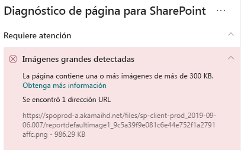

# Optimizar imágenes en páginas de sitio modernas de SharePoint Online

Lea este artículo para averiguar cómo optimizar imágenes en páginas de sitio modernas de SharePoint Online

Para obtener información sobre cómo optimizar imágenes en sitios de publicación clásicos, vea [Optimización de imágenes para SharePoint Online](image-optimization-for-sharepoint-online.md).

>[!NOTE]
>Para obtener más información sobre el rendimiento de los portales modernos de SharePoint Online, vea [Rendimiento en la experiencia moderna de SharePoint.](https://docs.microsoft.com/sharepoint/modern-experience-performance)

## Use la herramienta de Diagnóstico de página de SharePoint para analizar la optimización de imágenes

La herramienta de Diagnóstico de páginas para SharePoint es una extensión de explorador para los nuevos exploradores de Microsoft Edge (https://www.microsoft.com/edge) y Chrome que analiza las páginas del sitio de publicación clásicas y las modernas del portal de SharePoint Online. La herramienta le ofrece un informe para cada página analizada en el que se muestra el rendimiento de la página respecto a un conjunto definido de criterios de rendimiento. Para instalar e informarse de la herramienta Diagnóstico de página de SharePoint, visite [Usar la herramienta Diagnóstico de página para SharePoint Online](page-diagnostics-for-spo.md).

>[!NOTE]
>La herramienta de Diagnóstico de páginas solo funciona para SharePoint Online y no se puede usar en una página del sistema de SharePoint. 

Cuando analice un sitio moderno de SharePoint con la herramienta Diagnóstico de página de SharePoint, puede ver información sobre imágenes grandes en el panel _Pruebas de diagnóstico_.

Puede encontrarse con los siguientes resultados:

- **Atención requerida** (rojo): la página contiene **una o más** imágenes con un tamaño mayor a 300 KB
- **No se requiere ninguna acción** (verde): la página no contiene imágenes con un tamaño mayor a 300 KB

Si aparece **Se han detectado imágenes grandes** en la sección **Atención requerida** de los resultados, puede hacer clic en el propio resultado para ver más detalles.

## Corrección de problemas causados por imágenes grandes

Si una página contiene imágenes con un tamaño superior a 300 KB, seleccione el resultado **Se han detectado imágenes grandes** para ver qué imágenes superan ese tamaño. En las páginas de SharePoint Online modernas, las imágenes se representan automáticamente con un tamaño ajustado, dependiendo del tamaño de la ventana del explorador y la resolución del monitor del cliente. Siempre debe optimizar las imágenes para su uso en la web antes de cargarlas en SharePoint Online. Las imágenes muy grandes se reducen automáticamente en tamaño y resolución, lo que puede afectar a cómo se representan.

Antes de realizar revisiones de página para corregir problemas de rendimiento, anote el tiempo de carga de la página en los resultados del análisis. Ejecute la herramienta de nuevo después de la revisión y compruebe si los nuevos resultados están en línea con su valor de referencia. Luego, compruebe el nuevo tiempo de carga de la página para ver si se ha producido alguna mejora.

>[!NOTE]
>El tiempo de carga de la página puede variar en función de varios factores, como la carga de la red, la hora del día y otras condiciones transitorias. Debe probar el tiempo de carga de la página varias veces, antes y después de realizar cambios, para obtener un promedio.

## Temas relacionados

[Ajustar el rendimiento de SharePoint Online](tune-sharepoint-online-performance.md)

[Ajustar el rendimiento de Office 365](tune-office-365-performance.md)

[Rendimiento en la experiencia moderna de SharePoint](https://docs.microsoft.com/sharepoint/modern-experience-performance)

[Redes de entrega de contenido](content-delivery-networks.md)

[Uso de la red de entrega de contenido (CDN) de Office 365 con SharePoint Online](use-office-365-cdn-with-spo.md)
