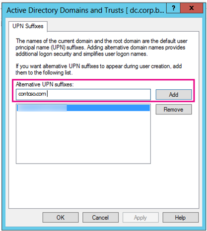

# <a name="prepare-a-non-routable-domain-for-directory-synchronization"></a>Preparar un dominio que no sean enrutables para sincronización de directorios
Al sincronizar el directorio local con Office 365 necesita tener un dominio verificado en Azure Active Directory. Sólo el usuario Principal nombres (UPN) que están asociados con el dominio local se sincronizan. Sin embargo, cualquier UPN que contiene un dominio que no sean enrutables, por ejemplo local (como billa@contoso.local), se sincronizará con un. dominio onmicrosoft.com (como billa@contoso.onmicrosoft.com). 

Si actualmente usa un dominio local para las cuentas de usuario en Active Directory, se recomienda cambiarlos para utilizar un dominio comprobado (como billa@contoso.com) con el fin de sincronizar correctamente con su dominio de Office 365.
  
## <a name="what-if-i-only-have-a-local-on-premises-domain"></a>¿Qué ocurre si sólo tiene un dominio local de local?

La herramienta más reciente que puede utilizar para la sincronización de Active Directory para Azure Active Directory se denomina Connect de Azure AD. Para obtener más información, vea [integración de sus identidades local con Azure Active Directory](https://docs.microsoft.com/azure/architecture/reference-architectures/identity/azure-ad).
  
Conectar de Azure AD sincroniza UPN y la contraseña de los usuarios para que los usuarios pueden iniciar sesión con las mismas credenciales que usan local. Sin embargo, Azure Connect AD sincroniza sólo a los usuarios de dominios que se comprueban por Office 365. Esto significa que el dominio también se comprueba Azure Active Directory porque se administran las identidades de Office 365 Azure Active Directory. En otras palabras, el dominio debe ser un dominio de Internet válido (por ejemplo, .com, .org,. NET, .us, etcetera). Si su Active Directory interno sólo usa un dominio no se puede enrutar (por ejemplo, local), posiblemente esto no puede coincidir con el dominio verificado que tiene en Office 365. Puede solucionar este problema cambiando el dominio principal en sus instalaciones en Active Directory o mediante la adición de uno o varios sufijos UPN.
  
### <a name="change-your-primary-domain"></a>**Cambiar su dominio principal**

Cambie su dominio principal a un dominio que se haya comprobado en Office 365, por ejemplo, contoso.com. A continuación, se actualiza cada usuario que tiene el dominio contoso.local a contoso.com. Para obtener instrucciones, vea [Funcionamiento de la cambiar el nombre de dominio](https://go.microsoft.com/fwlink/p/?LinkId=624174). Sin embargo, esto es un proceso muy implicado, y una solución más fácil es [UPN agregar sufijos y actualizar los usuarios a ellos](prepare-a-non-routable-domain-for-directory-synchronization.md#bk_register), como se muestra en la siguiente sección.
  
### <a name="add-upn-suffixes-and-update-your-users-to-them"></a>**Agregar sufijos UPN y actualizar los usuarios a ellos**

Puede resolver el problema. local mediante el registro de nuevo sufijo UPN o sufijos en Active Directory para que coincida con el dominio (o dominios) ha verificado en Office 365. Después de registrar el nuevo sufijo, actualice el usuario UPN para reemplazar el local con el nuevo nombre de dominio, por ejemplo, para que una cuenta de usuario tiene el aspecto billa@contoso.com.
  
Después de haber actualizado el UPN para usar el dominio verificado, está listo para sincronizar su Active Directory local con Office 365.
  
 **Paso 1: Agregar un nuevo sufijo UPN**
  
1. En el servidor que ejecuta los servicios de dominio de Active Directory (AD DS) en, en el administrador del servidor, elija **Herramientas** \> **y confianzas de dominios de Active Directory**.
    
    **O bien, si no dispone de Windows Server 2012**
    
    Presione la **tecla de Windows + R** para abrir el cuadro de diálogo **Ejecutar** y, a continuación, escriba en Domain.msc y, a continuación, elija **Aceptar**.
    
    
  
2. En la ventana **y confianzas de dominios de Active Directory** , secundario **y confianzas de dominios de Active Directory**y, a continuación, elija **Propiedades**.
    
    
  
3. En la ficha **Sufijos UPN** , en el cuadro **Sufijos UPN de alternativa** , escriba el nuevo sufijo UPN o sufijos y, a continuación, elija **Agregar** \> **Aplicar**.
    
    
  
    Elija **Aceptar** cuando haya terminado de agregar sufijos. 
    
 **Paso 2: Cambiar el sufijo UPN para los usuarios existentes**
  
1. En el servidor que ejecuta los servicios de dominio de Active Directory (AD DS) en, en el administrador del servidor, elija **Herramientas** \> **y equipos de Active Directory Active Directory Users**.
    
    **O bien, si no dispone de Windows Server 2012**
    
    Presione la **tecla de Windows + R** para abrir el cuadro de diálogo **Ejecutar** y, a continuación, escriba dsa.msc y, a continuación, haga clic en **Aceptar**
    
2. Seleccione un usuario, con el botón secundario y, a continuación, elija **Propiedades**.
    
3. En la ficha de **cuenta** , en la lista desplegable de sufijos UPN, seleccione el sufijo UPN nuevo y, a continuación, elija **Aceptar**.
    
    
  
4. Siga estos pasos para cada usuario.
    
    De forma alternativa masiva de actualización el UPN sufijos [también se puede usar Windows PowerShell para cambiar el sufijo UPN para todos los usuarios](prepare-a-non-routable-domain-for-directory-synchronization.md#BK_Posh).
    
### <a name="you-can-also-use-windows-powershell-to-change-the-upn-suffix-for-all-users"></a>**También puede usar Windows PowerShell para cambiar el sufijo UPN para todos los usuarios**

Si tiene una gran cantidad de usuarios que se debe actualizar, es más fácil de usar Windows PowerShell. En el ejemplo siguiente se utiliza los cmdlets [Get-ADUser](https://go.microsoft.com/fwlink/p/?LinkId=624312) y [Set-ADUser](https://go.microsoft.com/fwlink/p/?LinkId=624313) para cambiar todos los sufijos de contoso.local a contoso.com. 

Ejecute los siguientes comandos de Windows PowerShell para actualizar todos los sufijos de contoso.local a contoso.com:
    
  ```
  $LocalUsers = Get-ADUser -Filter {UserPrincipalName -like '*contoso.local'} -Properties userPrincipalName -ResultSetSize $null
  ```

  ```
  $LocalUsers | foreach {$newUpn = $_.UserPrincipalName.Replace("contoso.local","contoso.com"); $_ | Set-ADUser -UserPrincipalName $newUpn}
  ```
Consulte el [módulo de Active Directory de Windows PowerShell](https://go.microsoft.com/fwlink/p/?LinkId=624314) para obtener más información acerca del uso de Windows PowerShell en Active Directory. 

